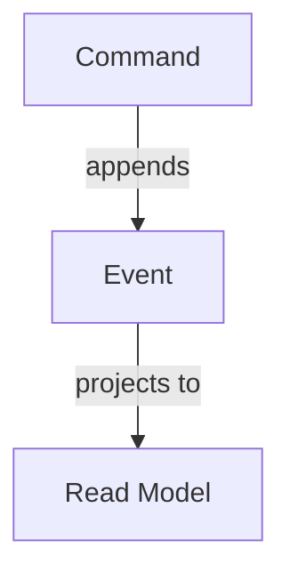

# Write Documentation

I need you to write **DocFX documentation** for a feature, component, or concept.

## Inputs

- **Subject** — what to document (e.g. "the Projects feature", "the CommandDialog component", "the ConceptAs type")
- **Type** — one of:
  - Feature documentation (end-user / developer guide)
  - API / concept reference
  - Component usage guide (for React components)
- **Target repo** — Arc, Chronicle, Fundamentals, Components, Studio, or VerticalSlices
- **Existing source files** — paste or reference the code to document

## Instructions

Follow `.github/instructions/documentation.instructions.md` exactly.

### File structure to produce

For a new topic under an existing section:
```
Documentation/<Section>/<Topic>/
├── index.md      ← main content page
└── toc.yml       ← local table of contents
```

Update the parent `toc.yml` to include the new topic.

### index.md format

```markdown
# <Topic Title>

Brief introductory paragraph — what this is and why it exists.

## Overview

Explain the concept at a high level. Use a Mermaid diagram if the architecture or flow benefits from visualisation:



## Usage

Show the most common usage pattern with a complete, runnable code example.

## Configuration

Document any configuration options.

## Advanced scenarios

Cover non-obvious or edge-case patterns.
```

### Mermaid diagrams

Use Mermaid for:
- Architecture diagrams (`graph TD` or `graph LR`)
- Sequence diagrams (`sequenceDiagram`) for request/response flows
- State diagrams (`stateDiagram-v2`) for lifecycle/state transitions

### toc.yml format

```yaml
- name: <Topic Title>
  href: index.md
```

For sub-topics:
```yaml
- name: <Topic Title>
  href: index.md
  items:
    - name: Sub-topic
      href: subtopic.md
```

### Writing style

- Use second-person active voice: "You can configure…" not "It is possible to configure…"
- Lead with the most important information
- Every code example must be complete and correct — no pseudo-code unless explicitly illustrating a concept
- Link to related topics using relative paths
- Do not document internal implementation details in user-facing docs

## Validation

- Verify `toc.yml` is valid YAML
- Verify all `href` values point to files that exist
- Verify all Mermaid blocks are valid (balanced brackets, correct syntax)
