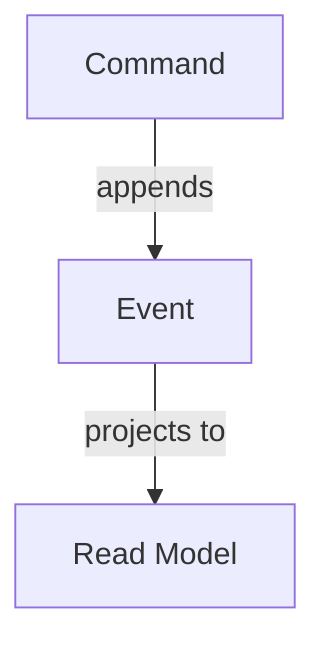

Write DocFX documentation for a feature, component, or concept.

## File structure

For a new documentation topic:

```
Documentation/<Section>/<Topic>/
├── index.md      ← main content page
└── toc.yml       ← local table of contents
```

Update the **parent** `toc.yml` to link to the new topic.

## `index.md` format

```markdown
# <Topic Title>

Brief intro — what this is and why it exists (1–2 sentences).

## Overview

High-level explanation. Include a Mermaid diagram if the architecture or flow benefits from visualisation.



## Usage

Show the most common usage pattern with a complete, runnable code example.

## Configuration / Options

Document any configuration properties, if applicable.

## Advanced

Cover edge cases or non-obvious patterns only if needed.
```

## `toc.yml` format

```yaml
- name: <Topic Title>
  href: index.md
```

With sub-topics:
```yaml
- name: <Topic Title>
  href: index.md
  items:
    - name: Sub-topic
      href: subtopic.md
```

## Writing rules

- Second-person active voice: "You can configure…" not "It is possible to configure…"
- Every code example must be complete and correct — no pseudo-code
- Link to related topics using relative paths
- Do not document internal implementation details in user-facing docs
- Use Mermaid for: architecture (`graph TD/LR`), sequence flows (`sequenceDiagram`), state transitions (`stateDiagram-v2`)

## Validation

- Verify `toc.yml` is valid YAML
- Verify all `href` values point to files that exist (or will exist when created)
- Verify all Mermaid blocks are syntactically valid
