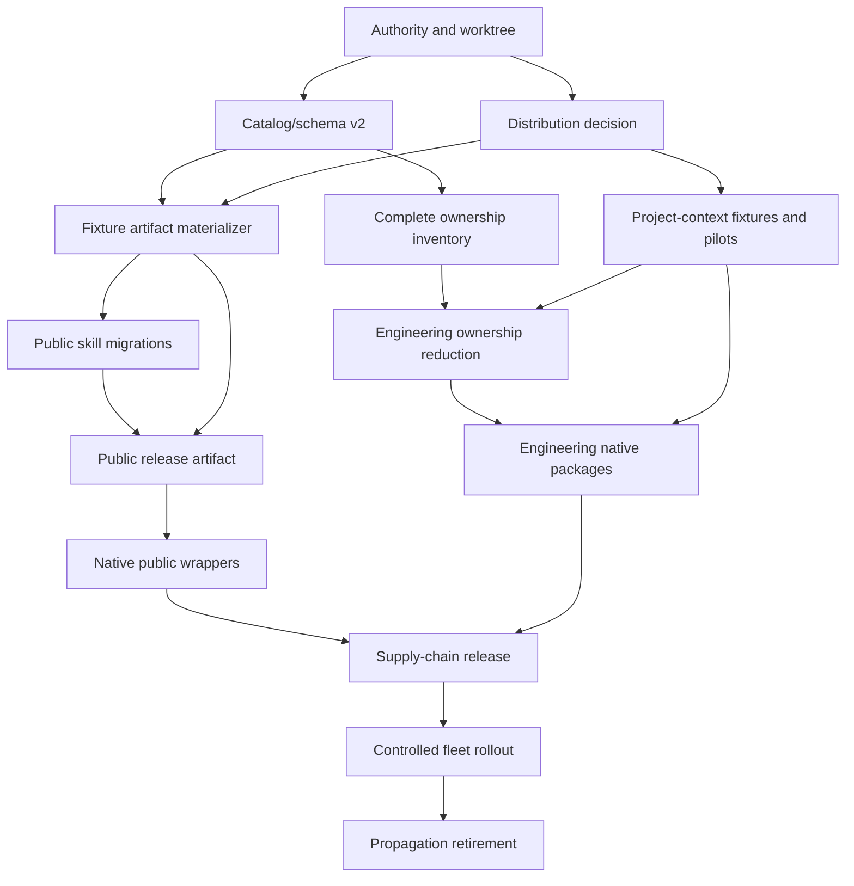

# Cratis/AI Repository Redesign — Implementation Plan

> **Superseded for current execution.** This plan records the reevaluation and
> foundation sequence. The expanded ecosystem, third-party, dedicated generated
> distribution repository, and autonomous program are governed by
> [`AI-REPOSITORY-REDESIGN-AUTONOMOUS-PLAN.md`](./AI-REPOSITORY-REDESIGN-AUTONOMOUS-PLAN.md).

**Prepared:** 2026-08-20
**Input:** [`AI-REPOSITORY-REDESIGN-REEVALUATION.md`](./AI-REPOSITORY-REDESIGN-REEVALUATION.md)
**Handover:** [`AI-REPOSITORY-REDESIGN-CONTINUATION-HANDOVER.md`](./AI-REPOSITORY-REDESIGN-CONTINUATION-HANDOVER.md)
**Execution prompt:** [`AI-REPOSITORY-REDESIGN-IMPLEMENTATION-PROMPT.md`](./AI-REPOSITORY-REDESIGN-IMPLEMENTATION-PROMPT.md)

## 1. Goal

Deliver a trustworthy, portable Cratis knowledge product without weakening the
engineering corpus, leaking operational behavior, overstating host parity, or
reintroducing uncontrolled repository propagation.

Success means:

- public Agent Skills and optional MCP are useful, current, self-contained, and
  portable;
- engineering behavior remains reusable where hosts support it, with explicit
  trust and capability differences;
- project-owned facts remain project-owned and discoverable through verified
  host mechanisms;
- every released byte is positively selected, hashed, reproducible, and
  validated after packaging;
- source, runtime artifact, executable package, and marketplace boundaries are
  unambiguous;
- update, canary, rollback, and retirement are operationally safe;
- no claim is greener than its evidence.

## 2. Non-goals

This program does not:

- turn AI into Stagehand or Ensemble;
- create a second workflow/policy/evidence engine;
- grant authority through a skill;
- publish private Cratis operations as public behavior;
- promise identical native components in every harness;
- replace product documentation or infer APIs from package internals;
- use a mixed source checkout as a public artifact;
- remove project-owned configuration;
- delete the legacy propagation model before verified replacement pilots;
- create MCP or Pi executable packages merely to satisfy a checklist;
- rewrite public history.

## 3. Governing principles

1. **Authority before movement.** Resolve ownership and distribution decisions
   before creating target trees.
2. **Source is not artifact.** Every installable product is materialized into a
   clean tree.
3. **Deny by default, select positively.** Runtime inclusion requires explicit
   approval and an exact file list.
4. **Portable core, native adapters.** Skills and MCP are portable; every other
   component is host-specific.
5. **Project facts stay local.** Shared packages never overwrite project context
   or bootstrap files.
6. **Passive and executable trust differ.** Skills, MCP servers, hooks, and Pi
   extensions use separate packages and reviews.
7. **Evidence is part of the contract.** Approval records source revision,
   digest, tests, security disposition, and reviewer.
8. **One behavior, one owner.** Stagehand, Ensemble, Workflows, AI, product docs,
   and consuming projects do not duplicate authority.
9. **Generate wrappers; do not hand-maintain behavior forks.** Native metadata
   projects one approved capability inventory.
10. **Rollback is designed, not improvised.** Every rollout has a pin, canary,
    observable state, and tested reversal.

## 4. Decision gates

No later phase may bypass these gates.

### D0 — Worktree and authority gate

Required evidence:

- protected-file baseline and branch divergence;
- current bodies/comments of `.github#24`, Workflows#68, AI#126, and AI#127;
- no conflicting accepted maintainer decision.

Pass outcome:

- exact scope authorized;
- every pre-existing change protected;
- source branch strategy stated.

### D1 — Distribution architecture gate

Choose and record one:

- **Preferred:** one canonical source plus generated public-only release
  tree/ref/archive;
- separate public product and engineering repositories;
- another design meeting every acceptance criterion.

Required questions:

- Can Cursor, Gemini, Kiro, Copilot, Claude, OpenAI, VS Code, and direct skill
  installers consume the public-only result?
- Does any install path materialize source-only engineering content?
- Can every release pin an immutable commit/version/hash?
- Who owns update, canary, rollback, emergency disable, and wrapper cleanup?
- How does `gh skill --all` avoid engineering discovery?

Fail outcome:

- no target source tree or manifest is created.

### D2 — Project-context gate

Required evidence:

- host-recognized bootstrap/configuration matrix;
- application and framework fixture tests;
- migration behavior when `.cratis/PROJECT.md`, `.agents/PROJECT.md`, both, or
  neither exists;
- proof that no project file is overwritten or merged automatically.

### D3 — Catalog and artifact-policy gate

Required evidence:

- complete current source/artifact accounting;
- independently approvable targets;
- evidence-bound claims and approvals;
- fixture materializer rejects every forbidden path/resource class;
- catalog approval cannot bypass staging validation.

### D4 — Public skill quality gate

Per target:

- one capability and one trigger intent;
- explicit near misses and collision family;
- no engineering or project-local dependency;
- current official/documented Cratis behavior;
- behavior evals;
- positive and negative trigger evals;
- collision tests;
- security review where risk requires it;
- human approval at an exact revision/digest.

### D5 — Release candidate gate

Required evidence:

- clean materialized tree and exact SHA-256 inventory;
- no symlinks or special files;
- schemas and host validators pass where available;
- unpacked npm/archive revalidation passes;
- wrapper inventory and version parity pass;
- representative install smoke tests pass;
- immutable source and rollback target exist;
- no secret/private-data findings.

### D6 — Propagation retirement gate

Required evidence:

- one application and one framework pilot;
- public and engineering installation both verified;
- project context verified in every supported Tier 1 host;
- update and rollback exercised;
- target repositories no longer depend on copied shared content;
- Workflows-owned fleet state is observable and recoverable.

## 5. Workstream dependency graph

## 6. Pull-request sequence

Keep each pull request reviewable, independently reversible, and free of
unrelated protected work.

### PR-A — Reevaluation and decision record

Scope:

- canonical reevaluation report, handover, plan, and prompt;
- current ecosystem registry corrections;
- strict catalog parser regression;
- additive supersession notes.

Gate:

- documentation/catalog/tooling validation only;
- no source movement or manifests.

This worktree currently contains this scope but no PR has been requested or
created.

### PR-B — Catalog/schema v2

Scope:

- `sources`, `targets`, `migrations`, `artifacts`, `evidence`, and approval model;
- v1-to-v2 migration/equivalence validation;
- direct evidence references for ecosystem and product claims;
- strict Draft 2020-12 validation or explicit unsupported-keyword failure.

Required tests:

- all 43 legacy sources preserved exactly once;
- one-to-many split targets independent;
- many-to-one merge target complete;
- rejected/candidate targets never runtime eligible;
- approval missing revision, digest, reviewer, evals, or security evidence fails;
- unknown properties and duplicate IDs fail;
- stale/expired evidence fails where policy requires reverification.

Rollback:

- retain readable v1 until v2 equivalence is proven; remove v1 only in a later
  explicit cleanup.

### PR-C — Complete artifact ownership inventory

Scope:

- schema-backed inventory of every rule, agent, prompt, hook, script, workflow,
  adapter, symlink/path reference, skill resource, eval, document, Pi extension,
  and generated surface;
- mechanical path expansion so grouped records cannot hide omissions;
- current and target owner, risk, generated state, runtime eligibility, and
  migration state.

Required tests:

- `git ls-files` plus explicitly admitted untracked redesign sources reconcile
  to inventory or documented repository-only exclusions;
- every adapter points to an inventoried source;
- every generated surface names its generator;
- every obsolete record names replacement evidence and deletion gate.

Rollback:

- inventory-only; no current path changes.

### PR-D — Fixture-only public artifact materializer

Scope:

- empty staging directory;
- exact approved source selection;
- `lstat`/`realpath` containment;
- sorted file/digest manifest;
- safe archive pack/unpack/revalidation;
- recursive skill-discovery simulation;
- no live manifests or public source move.

Adversarial fixtures:

- escaping and internal symlinks;
- junction/reparse abstraction where testable;
- FIFO/device/socket/special file;
- `../`, absolute, duplicate, case-collision, Unicode-normalization collision;
- hidden directory and dotfile;
- unlinked reference/asset;
- reference escaping skill root;
- forbidden script/eval/rule/agent/prompt/hook/LSP/tooling/workflow;
- private URL, local absolute path, secret-shaped value;
- `engineering/skills/*/SKILL.md` recursive discovery leak;
- archive traversal and oversized entry.

Gate:

- test fixtures only until D1 is accepted.

### PR-E — Project-context contract and pilots

Scope:

- specification and fixtures for `.cratis/PROJECT.md`;
- minimal root `AGENTS.md`, `CLAUDE.md`, and `GEMINI.md` bootstrap patterns;
- legacy fallback behavior;
- one application and one framework pilot plan.

Required behavior:

- `.cratis` wins when both files exist;
- legacy file is read only as fallback;
- neither file is a valid no-context state;
- existing bootstraps/project content are never overwritten;
- non-interactive/offline behavior is explicit;
- bootstrap content contains no shared policy beyond locating project context.

Fleet rollout belongs to Workflows and is not part of this PR.

### PR-F — Engineering ownership reduction in place

Scope:

- classify and reduce rules, agents, prompts, hooks, workflows, and engineering
  skills before movement;
- remove duplicate authority and obsolete product vocabulary;
- define host-native capability projections;
- preserve protected hook behavior.

Gate:

- no public candidate depends on engineering content;
- every target owner is accepted;
- Workflows/Stagehand/Ensemble handoffs are explicit;
- no path move yet.

### PR-G — Engineering source move

Scope:

- move accepted engineering sources to non-auto-discovered paths;
- never use `engineering/skills/`;
- keep original adapters until host replacements are verified;
- move the complete `skill-creator` licensed bundle together.

Gate:

- catalog and adapter graph updated atomically;
- protected hook intent preserved byte-for-byte or behavior-equivalent with tests;
- source checkout does not become a public install surface.

Rollback:

- originals remain until pilots verify replacements.

### PR-H1 — Fundamentals and specification foundations

Targets:

- concepts;
- type discovery;
- C# and TypeScript specification foundations.

Gate:

- no application-scenario trigger collision;
- current APIs and self-contained references.

### PR-H2 — Arc capabilities

Targets:

- commands;
- command execution;
- business-rule split;
- auth/identity;
- paging and observable-query HTTP;
- EF migration.

Gate:

- command validation and Chronicle constraints independently approved;
- auth security review;
- paging guidance is authoritative and performance guidance aligned.

### PR-H3 — Chronicle capabilities

Targets:

- event modeling and diagrams;
- projections, read models, reducers, reactors;
- metadata, migrations, multi-tenancy, operations;
- event/read-model specs.

Gate:

- replay and concurrency tests;
- operations separates read-only and mutating flows with confirmations;
- no engineering `ship-changes` dependency.

### PR-H4 — Application, React, and Components

Targets:

- vertical-slice merge experiment;
- feature shell and React page;
- stepper dialog and toolbar;
- application backend/frontend specs;
- diagnostics.

Gate:

- current installed/documented APIs;
- vertical-slice architecture and implementation trigger tests prove the merge
  improves routing; otherwise retain two targets.

### PR-H5 — Review skills

Targets:

- code review;
- performance review;
- security review.

Gate:

- one canonical checklist per concern;
- no contradictory paging, validator, ID, cookie, or barrel guidance;
- specialist triggers provide measurable additional value.

### PR-I — Public-only source projection and static validation

Scope:

- create accepted public source projection after D1–D4;
- materialize approved targets;
- no package yet;
- strict skill/link/payload validation.

Gate:

- every public target independently approved;
- recursive discovery finds only approved public targets.

### PR-J — Agent Plugin and passive `@cratis/ai`

Scope:

- generate root Agent Plugin in a clean release tree;
- generate passive npm/Pi package metadata;
- package content and version parity checks;
- no MCP or Pi executable code.

Gate:

- Agent Plugin schema and available client validators;
- `npm pack --dry-run --json` exact allowlist;
- unpacked artifact revalidation;
- `gh skill publish --dry-run` only on a supported installed CLI;
- Pi temporary/user/project install smoke tests;
- immutable release candidate.

### PR-K — Native public wrappers

Scope:

- VS Code/Copilot extension namespace where needed;
- Claude, OpenAI/Codex, Gemini, Cursor, Kiro, and provisional Junie metadata;
- same public inventory, no independent behavior.

Gate:

- wrapper/component parity;
- host validation and install smoke tests where available;
- unsupported marketplace paths labeled provisional;
- no paid CI requirement for ordinary PR validation.

### PR-L — Engineering native packages

Scope:

- per-host, capability-accurate engineering packages;
- managed/user/project installation policy;
- executable trust disclosures;
- optional `@cratis/pi` only if it provides genuine Pi-native value.

Gate:

- no false parity claim;
- persistent rules use verified managed/project mechanisms;
- executable packages receive security review and isolation guidance;
- project context remains project-owned.

### PR-M — Supply chain and release automation

Scope:

- pinned actions;
- exact Node/npm versions;
- trusted publishing and provenance;
- immutable GitHub releases and attestations;
- checksums, SBOM for executable packages, secret scanning;
- staged/unpacked validation;
- scheduled ecosystem drift monitoring.

Gate:

- clean checkout reproduces the release candidate;
- no developer-machine publication path;
- protected environments/reviewers for executable release;
- rollback to prior immutable version tested.

### PR-N — Marketplace submissions

Scope:

- human-reviewed submissions only after release evidence;
- public legal/support/privacy/terms assets where required;
- OpenAI positive/negative tests and MCP scans if applicable;
- Claude community, Cursor, Kiro, Gemini gallery, Pi gallery, Copilot/VS Code,
  and Junie status recorded accurately.

Gate:

- do not claim listing until externally observable;
- interactive/paid requirements remain protected manual steps.

### PR-O — Controlled rollout and propagation retirement

Scope:

- Workflows-owned canary;
- application and framework pilots;
- package/ref pinning and update test;
- rollback and emergency disable;
- project-owned adapter/bootstrap migration;
- obsolete wrapper removal only after fleet evidence.

Gate:

- D6 passes;
- partial failures are named and nonzero;
- no target can republish its local corpus to the fleet;
- old topology cannot be restored accidentally.

## 7. Quality strategy

### Static correctness

- strict schema validation;
- closed object shapes;
- exact path accounting;
- American English checks where reliable;
- no generated-file edits;
- Markdown links/anchors;
- no stale semantic names or old paths.

### Behavioral correctness

Per public skill:

- 2–3 behavior cases during migration, growing with risk;
- objective assertions where possible;
- old-vs-new baseline comparison;
- human review of correctness and usability;
- no token-growth-only “improvement.”

### Trigger correctness

Per public skill:

- 8–10 realistic positive prompts;
- 8–10 difficult negative/near-miss prompts;
- collision-family runs with adjacent skills;
- explicit false-positive and false-negative review;
- merged/split decisions justified by evidence, not preference.

### Artifact correctness

- exact manifest and SHA-256 list;
- byte comparison between approved source and stage;
- no symlinks/special files;
- archive entry validation before extraction;
- post-extraction containment and digest verification;
- wrapper inventory equality;
- version parity;
- installation from the actual release artifact, not source checkout.

### Security correctness

- secret/private URL/local path scans;
- prompt-injection and destructive-operation review;
- no embedded credentials or static auth headers;
- least-privilege MCP tools;
- explicit read/write/open-world/destructive annotations;
- bounded output, timeout, cancellation, and redaction;
- immutable sources and provenance;
- executable packages isolated from passive skills.

### Operational correctness

- clean checkout reproduction;
- offline behavior where promised;
- non-interactive CI without paid auth;
- canary and rollback evidence;
- scheduled spec/client drift detection;
- no silent partial rollout.

## 8. Risk register

| Risk | Likelihood | Impact | Control | Owner |
| --- | --- | --- | --- | --- |
| Engineering content leaks through recursive skill discovery | High without redesign | High | public-only staging/ref; nonstandard engineering source path; adversarial fixture | AI |
| Native wrappers drift | Medium | High | generated wrappers and inventory parity | AI |
| Project context is not loaded | High without bootstrap | High | host matrix, bootstraps, app/framework pilots | AI + consuming project |
| Propagation removal strands repositories | Medium | High | Workflows canary, pin, rollback, observable fleet state | Workflows |
| Skill guidance uses stale APIs | High in legacy corpus | High | official/product source review, compilation where possible, behavior evals | Product skill owner |
| High-risk operation executes unexpectedly | Medium | Critical | separate read/mutate flow, explicit confirmation, policy and security evals | Skill owner + security reviewer |
| Mutable marketplace source is compromised | Medium | Critical | immutable SHA/version/archive, attestation, reviewed update | Release owner |
| Public package executes code unexpectedly | Low if passive boundary holds | Critical | no lifecycle scripts; exact contents; separate executable packages | Release owner |
| Claims exceed tested support | Medium | High | evidence-bound claim state and installation records | Catalog owner |
| Paid/manual marketplace requirement blocks CI | High | Medium | structural PR checks; protected manual release checklist | Release owner |
| Scope grows into MCP/Pi without product need | Medium | Medium | admission gate and separate package decision | Maintainer |
| Source move absorbs protected work | Medium in dirty worktree | High | hash baseline, narrow edits, no staging/commit without request | Implementer |

## 9. Ownership and review model

| Concern | Accountable owner | Required review |
| --- | --- | --- |
| Public product skill behavior | Relevant Cratis product maintainer | Product/API + skill quality |
| Engineering rules/agents/prompts/hooks | Cratis engineering | Engineering + security for executable behavior |
| Distribution control and fleet rollout | Cratis/Workflows | Operations + rollback review |
| Stagehand control plane | Cratis/Stagehand | Architecture + security |
| Ensemble workflows/policy/evidence | Cratis/Ensemble | Architecture + contract review |
| Project facts/bootstrap content | Consuming repository | Project maintainer |
| Passive release artifact | Cratis/AI release owner | Artifact + supply-chain review |
| MCP/Pi executable packages | Separate package owner | Security + protocol/host review |
| Marketplace listing | Release owner + vendor reviewer | Legal/support/privacy where required |

## 10. Versioning and release policy

Before the first public release:

- choose one passive-product version source;
- generate every passive manifest and wrapper version from it;
- allow MCP/Pi executable packages to version independently;
- use immutable release tags/assets;
- publish npm through trusted publishing and provenance;
- attach exact checksums and release attestations;
- record every marketplace version/source pin;
- document renamed/retired skills and old install migration;
- publish only after clean-checkout reproduction.

SemVer proposal:

- patch: factual correction without trigger/workflow contract change;
- minor: new skill or backwards-compatible workflow/reference improvement;
- major: skill removal/rename, trigger contract change, incompatible install or
  package shape, or incompatible MCP tool/schema behavior.

## 11. Rollback policy

Every release and rollout plan must name:

- previous known-good immutable version/ref;
- rollback command or marketplace pin change;
- project package/ref reversal;
- generated bootstrap/adaptor reversal without deleting project content;
- fleet repositories affected;
- success/failure telemetry and timeout;
- owner authorized to stop rollout;
- recovery when a marketplace cannot roll back immediately.

Do not delete old adapters or propagation wrappers in the same change that first
introduces their replacement.

## 12. Definition of done

The redesign is done only when:

### Authority

- distribution and repository boundaries are explicitly accepted;
- every artifact has one owner;
- Stagehand, Ensemble, Workflows, AI, and project responsibilities do not
  overlap.

### Public product

- every public skill is self-contained, current, evaluated, and approved;
- root Agent Plugin validates against the current specification;
- public artifacts contain only exact approved files and no symlinks;
- native wrappers expose identical skills/MCP behavior;
- real install smoke tests pass for Tier 1 hosts.

### Engineering

- shared engineering behavior is reduced, not merely relocated;
- host-native packages state capability gaps and trust accurately;
- project-specific folders are available for project-owned content;
- `.cratis/PROJECT.md` plus bootstraps works in application and framework pilots.

### Supply chain

- clean checkout reproduces immutable release artifacts;
- npm trusted publishing/provenance is active;
- checksums/attestations exist;
- executable packages receive security review and SBOM where applicable;
- scheduled ecosystem drift monitoring exists.

### Operations

- Workflows canary, update, rollback, and partial-failure reporting pass;
- no repository relies on copied public skills from uncontrolled propagation;
- legacy topology cannot restart accidentally;
- public/marketplace support claims match observed installations.

## 13. Current next action

Execute
[`AI-REPOSITORY-REDESIGN-IMPLEMENTATION-PROMPT.md`](./AI-REPOSITORY-REDESIGN-IMPLEMENTATION-PROMPT.md).
It implements only the decision/catalog/inventory/materializer foundation and
stops before source movement or manifest creation.

## 14. Foundation implementation update — 2026-08-20

The bounded foundation was implemented without resuming old PR-2:

- Workflows#68 was re-read through authenticated, read-only GitHub access. It
  remains open, and its maintainer comment confirms that distribution,
  versioning/override policy, canary, wrapper retirement, and freeze lifting are
  unresolved.
- Catalog v1 remains readable. Catalog v2 adds separate sources, targets,
  migrations, artifacts, evidence-bound ecosystem facts, product coverage and
  released-claim state, plus repository ownership.
- All 43 current skill sources remain accounted for. The business-rule split
  has two independent candidate targets; the vertical-slice merge remains one
  evaluation-required candidate target. No target is approved or runtime
  eligible.
- A schema-backed inventory mechanically expands 33 ownership groups over every
  tracked path and explicitly admitted redesign path. Expected counts and
  sorted path digests make grouping drift fail validation.
- A fixture-only public artifact materializer starts from an absent staging
  directory, applies exact file selection, rejects symlinks/special files/path
  collisions/forbidden or private content, hashes every runtime file, and
  safely packs/unpacks a bounded fixture archive.
- The recursive-discovery fixture proves an `engineering/skills/` source path
  leaks through `--all`-style discovery and is rejected.
- Project-context fixtures prove canonical `.cratis/PROJECT.md` precedence,
  legacy fallback, no-context behavior, minimal host bootstraps, and
  non-overwrite of project content.
- The custom schema validator now fails explicitly on unsupported vocabulary
  instead of silently accepting unknown Draft 2020-12 keywords.

D1 remains failed because no distribution architecture is accepted. Therefore
PR-F ownership reduction, PR-G source movement, manifests, packages, install
instructions, release refs, publication, propagation changes, and wrapper
retirement remain blocked.

The dormant prompt for the first source move is
[`AI-REPOSITORY-REDESIGN-FIRST-SOURCE-MOVE-PROMPT.md`](./AI-REPOSITORY-REDESIGN-FIRST-SOURCE-MOVE-PROMPT.md).
It must not be executed until its authority, catalog, ownership, and pilot
preconditions have accepted evidence.
