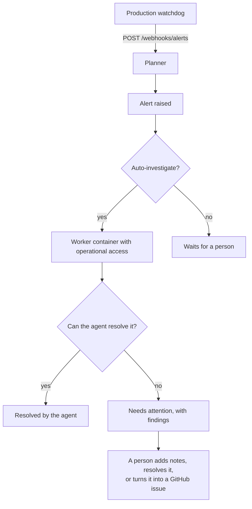

# Alerts from running systems

A production watchdog that finds something wrong has two options: wake someone up, or be ignored.
Cratis Studio's cluster-health watchdog picks the first - it posts to Discord every five minutes for
as long as a condition lasts. That works right up until the condition is something an agent could
have fixed in thirty seconds, and instead it sat in a channel until someone read it.

The Planner gives that watchdog a third option: post the alert here, and an agent looks at it
immediately. If it can resolve it, it does. If it cannot, the alert lands on a board marked
**Needs attention**, with the agent's findings already attached - so the person who picks it up
starts from evidence rather than from a notification.

## The flow



## Sending alerts

Post JSON to `https://<planner-host>/webhooks/alerts`. Two payload shapes are understood.

The Planner's own shape says everything explicitly:

```json
{
    "source": "studio-production",
    "title": "Loki is crash looping",
    "summary": "studio/loki-0 container 'loki': CrashLoopBackOff (restarts: 370)",
    "severity": "critical",
    "fingerprint": "pod:studio/loki-0:CrashLoopBackOff"
}
```

The **Discord webhook shape** is understood too:

```json
{
    "embeds": [{
        "title": "[studio] 2 cluster issue(s) need attention",
        "description": "New since the last alert:\n- studio/loki-0 container 'loki': CrashLoopBackOff",
        "color": 15158332
    }]
}
```

That is not a curiosity - it is the point. Operational alerting already speaks Discord, so pointing
an existing `watchdogDiscordWebhookUrl` at the Planner is the whole integration: no change to the
watchdog, and no second alerting path to keep working. A Discord delivery has no `source` (the
configured `Planner:Alerts:DefaultSource` is used), no `fingerprint` (the title is used), and no
`severity` (a red embed reads as critical, anything else as a warning).

### Signing deliveries

Set `Planner:Alerts:WebhookSecret` and sign the raw body with HMAC-SHA256, sending the result as
`X-Planner-Signature-256: sha256=<hex>` - the same scheme GitHub uses:

```bash
BODY='{"source":"studio-production","title":"Loki is crash looping","summary":"...","severity":"critical","fingerprint":"pod:studio/loki-0:CrashLoopBackOff"}'
SIGNATURE=$(printf '%s' "$BODY" | openssl dgst -sha256 -hmac "$ALERT_SECRET" | awk '{print $2}')
curl -fsS -X POST "https://planner.example.com/webhooks/alerts" \
    -H 'Content-Type: application/json' \
    -H "X-Planner-Signature-256: sha256=${SIGNATURE}" \
    -d "$BODY"
```

Leaving the secret empty accepts unsigned deliveries. Do that locally and nowhere else - the
endpoint is public, and an unsigned one lets anyone schedule agent work against your cluster.

### One condition is one alert

A watchdog re-reports a condition it cannot fix for as long as it lasts. The Planner keys an alert
on its **source and fingerprint**, so every repeat delivery is recorded as another sighting of the
alert already open - the occurrence count goes up, the summary and severity refresh, and no second
investigation is queued. A condition that was *resolved* and fires again genuinely is new: whatever
fixed it stopped holding, so it is raised again and investigated again.

## What an agent can reach

An agent asked why a production system is unhappy needs to be able to look at that system. The
`Planner:Operations` configuration is what gives it one, and it is deliberately the diagnosis
surface and nothing more - see [Configuration](./configuration.md#operations---planneroperations):

| Configured | The agent gets |
| --- | --- |
| `Kubeconfig` | `kubectl` and `helm` against your cluster, in `KubernetesNamespace` |
| `DockerHost` | the `docker` CLI against that daemon |
| `LokiUrl` | logs, queried with `curl` against `/loki/api/v1/query_range` |
| `GrafanaUrl` | Grafana's API |
| `Repositories` | those repositories cloned, so it can correlate behavior with code |

Everything is optional and the prompt states exactly what is available, so an agent with no access
reasons from the alert and says so, rather than spending its session failing at `kubectl`. **No
database credentials are ever handed over** - an agent that can read a cluster and its logs can
explain almost any operational failure, and one that can also read the data can leak it.

Scope the kubeconfig's credential to what an investigation legitimately needs: reading pods, nodes,
events and logs, and restarting a workload. The agent is told never to widen its own access and
never to disable an alert or a health check to make a symptom go away.

## Working an alert

The **Alerts** page lists everything reported, newest activity first, with what an agent made of it.
Statuses are:

| Status | Meaning |
| --- | --- |
| **Received** | Reported, waiting for an agent |
| **Investigating** | An agent is looking at it right now - its console streams on the *Work* page |
| **Resolved** | Closed, by the agent that investigated it or by a person |
| **Needs attention** | An agent looked and could not resolve it. Its findings are attached |
| **Investigation failed** | The agent's session failed or was stopped, so nothing is known yet |

From the toolbar you can:

- **Investigate** - put an agent on it (again). Useful after configuring operational access, or when
  a condition has changed.
- **Add note** - record what you found on the way to a fix. Notes accumulate; they are not a single
  overwritten field.
- **Create issue** - turn the alert into a GitHub issue. The dialog opens with the repository your
  deployment nominates for operational issues (`Planner:Operations:IssueOwner` /
  `IssueRepository`), the alert's title, and a description already composed from what was reported,
  what the agent found, and every note - all editable before you file it. The repository must be one
  the Planner tracks, which also means the new issue is mirrored straight back onto the issue board.
- **Resolve** - close it, saying how. Resolving an alert an agent handed back pre-fills the
  resolution with the agent's findings.
- **Delete** - take it off the board entirely, for noise that should not have been reported. The
  alert's history stays in the event log; only the row goes.

## When this is the wrong fit

This is for **operational** conditions - something is wrong with a system that is running. It is not
an issue tracker: work that means changing code belongs on the issue board, which is exactly what
**Create issue** is for. It is also not a pager: the Planner does not wake anyone up, so keep your
existing notification channel for the alerts a human must see within minutes, and point the Planner
at the same webhook so an agent gets a look at them too.

## See also

- [Configuration](./configuration.md) - the `Planner:Alerts` and `Planner:Operations` reference.
- [How it works](./how-it-works.md) - the issue-to-pull-request flow this sits alongside.
- [Running in the cloud](./running-in-the-cloud.md) - injecting operational credentials as secrets.
