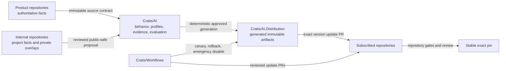

# Review the Cratis AI ecosystem-support architecture

This page is the maintainer-level review surface for the ecosystem-support
foundation. Review the architectural decisions, compatibility boundaries, and
truthful support state here; the generated catalogs remain available when an
exact identity, path, digest, or evidence record needs inspection.

## Why this change exists

The previous shared corpus mixed canonical behavior, host adapters, internal
repository needs, and propagation mechanics. It had no single machine-readable
answer for:

- which behavior was canonical;
- which products and hosts were covered;
- which bytes belonged in a package;
- which evidence proved generation, installation, behavior, or lifecycle;
- which effects were passive or executable;
- whether a package, marketplace listing, or support claim was authorized;
- how an improvement discovered in another repository should return upstream.

The new architecture establishes one canonical authoring and approval point,
one-way generated delivery, exact evidence, and explicit blocked states instead
of inferring readiness from the presence of files.

## Architecture after the change



There is no automatic reverse file synchronization. Consumer feedback travels
upstream as a proposal plus immutable authority evidence. Package bytes travel
downstream only through a reviewed immutable release.

## Added

### Ecosystem and host contracts

The catalogs now account for 45 ecosystem bindings and host-native discovery,
manifest, lifecycle, executable, and marketplace boundaries. Coverage and
support remain different concepts.

Relevant sources:

- `catalog/v2/ecosystem-contracts.json`
- `catalog/host-adapters.json`
- `distribution/ecosystem-artifact-bindings.json`
- `distribution/artifact-assurance-policy.json`

### Evidence and support ladder

Evidence is normalized by exact subject, version, artifact digest, host,
environment, validity window, outcome, and assurance. Technical support is
computed through this monotonic ladder:

```text
unsupported
→ documented
→ generated
→ statically-validated
→ install-tested
→ behavior-tested
→ lifecycle-tested
→ release-tested
→ supported
```

This ladder is the governed-support lane, not the ordinary passive-preview gate.
Candidate review and passive preview use basic deterministic, safety, review,
and smoke checks; they remain explicitly unsupported. The full evidence ladder
stays available for stable support, executable/MCP behavior, and broad rollout.

Current state:

- 24 bindings are documented;
- 21 bindings are statically validated;
- no binding is install-tested or higher;
- no support claim exists.

Relevant sources:

- `catalog/evidence.json`
- `catalog/support-policy.json`
- `catalog/v2/support.json`
- `catalog/evidence-baseline.json`

### Deterministic passive generation

Canonical passive skills can be projected to Agent Skills, Agent Plugins 1.0,
and reviewed native skill layouts. Generation uses closed inventories, canonical
byte parity, collision detection, checksum verification, and complete candidate
cleanup on failure.

Static generation is not host behavior or installation evidence.

### First-class component model

Skills, rules, instructions, prompts, commands, agents, hooks, MCP, LSP, and
executable extensions are modeled separately. Canonical ownership never moves
to a host adapter or generated file.

Relevant sources:

- `catalog/components.json`
- `catalog/component-projections.json`
- `catalog/v2/components.json`
- `catalog/v2/component-projections.json`

The generated v2 copies are retained as reviewable, digest-bound snapshots.
They are large and mostly mirror authored records, but current generators,
schemas, human catalogs, and drift checks consume them. Replacing them with
metadata sidecars is a possible later refactor, not a safe deletion in this
change.

### Chronicle and Studio MCP safety boundaries

Chronicle and Studio have separate product identities and deny-by-default
classification catalogs. Public guidance contains no admitted executable tool
or prompt inventory. Studio cannot reuse Chronicle evidence, and dynamic
operation delegation cannot become an observational permission.

This adds safety guidance—not an MCP server package or invocation path.

### Native non-skill fixtures

Seventy repository-only static fixture projections validate documented native
rule and instruction layouts for JetBrains AI Assistant, Tabnine, Visual Studio
Copilot, and Devin. They have no package identity, installation contract, host
activation, or support claim.

### Real-host canary contracts

The canary runner requires exact host versions, isolated homes, allowlisted
environments, forbidden credentials, denied egress, complete phase reports, and
project-context preservation.

Current evidence is deliberately limited:

- Pi 0.84.3 passed a synthetic non-supporting install/list/remove fixture;
- Claude, Copilot, Codex, and Gemini preflights stopped on exact-version
  mismatch;
- discovery, behavior, collision, genuine update, and rollback remain blocked.

### Release and marketplace readiness

Release readiness is generated as `BLOCKED` with explicit prerequisites.
Candidate generation cannot grant publication. Every credentialed publication,
Distribution, cleanup, promotion, and recovery job is unreachable while the
blocked preflight emits `release_allowed=false`.

No release request, release record, approval, control attestation, marketplace
publication, supported package, or production publication exists.

### Maintainer contribution workflow

[Maintaining shared AI behavior](./maintaining-shared-ai-behavior.md) defines
how internal repositories classify local findings, keep private facts local,
propose reusable behavior, update product authority first, change canonical AI
source, release a new version, and adopt it through a reviewed exact-pin update.

## Changed

- Shared behavior now has one canonical merge point in `Cratis/AI`.
- Product facts remain authoritative in product repositories.
- Internal/private repositories use public-safe engineering profiles plus local
  overlays.
- Host-specific copies are generated projections instead of competing sources.
- Support and marketplace availability are computed or evidenced, never inferred
  from a manifest.
- Real-host execution moved out of ordinary tests into a dual-opt-in isolated
  runner.
- Release generation is candidate-only; release authority comes from readiness,
  exact approvals, evidence, and protected merge topology.
- Release-generation timing runs in a separate scheduled/manual benchmark
  workflow rather than the blocking correctness gate.
- Updates are designed as reviewed exact-pin pull requests rather than folder
  pushes.

## Removed or retired

- Broad all-to-all corpus propagation as the target architecture.
- Automatic reverse synchronization from consuming repositories.
- Direct installation from the mixed authoring repository.
- Floating release pins such as `latest`.
- Generated distribution bytes as authoring inputs.
- Implicit host execution merely because a binary exists on a developer machine.
- A generator argument that could turn publication eligibility on.
- Release or marketplace readiness inferred from implemented workflow code.

The legacy Copilot propagation/synchronization workflows and their re-armable
shell scripts are removed. Historical authority evidence remains, but no
executable propagation entry point is retained in this repository.

## Compatibility

### Compatible at the static contract level

- Agent Skills canonical packages
- Agent Plugins Specification 1.0.0 passive packages
- Existing repository-local Claude, Copilot, Codex, and Pi adapters
- Reviewed native passive skill roots
- Four native non-skill fixture layouts
- Existing internal repository rules and local overlays

Static compatibility means the shape and bytes conform to the reviewed contract.
It does not mean installation, discovery, behavior, lifecycle, or support has
passed.

### Preserved compatibility

- Existing `.ai` canonical sources remain canonical.
- Existing host adapters remain modeled and byte-validated.
- Repository-local `AGENTS.md`, `.cratis/PROJECT.md`, local skills, and Pi
  settings remain project-owned.
- Private Studio, Stagehand, customer, infrastructure, and incident behavior
  stays in local overlays.
- Existing S5 passive roots remain separate from S8 fixture roots.

### Not yet compatible or supported at runtime

- No profile package is currently published or supported.
- Claude, Copilot, Codex, and Gemini local versions do not match the current
  canary matrix.
- Pi fixture package listing is not skill discovery or behavior evidence.
- Chronicle and Studio MCP operations remain unadmitted.
- Native non-skill singleton files have no collision-safe install/merge contract.
- Marketplace manifests are not live listings.
- Subscriber update automation is not active.
- npm ownership, OIDC trusted publishing, protected environments, and production
  lifecycle evidence are not yet admitted.

## Kept deliberately

Do not remove these merely to reduce line count:

- Generated v2 catalog snapshots—the current drift and human-catalog contracts
  consume them.
- Deny-all MCP classification machinery—it prevents silent future admission.
- The Studio MCP safety skill—even with no admitted source contract or operation,
  its useful behavior is the explicit fail-closed instruction not to infer,
  discover, configure, or invoke Studio operations. It exposes no private Studio
  implementation fact and should remain until evidence can safely admit a
  narrower observational surface.
- Blocked host entries—they make absent lifecycle coverage explicit.
- S8 expected trees—they prove complete deterministic static inventory.
- S9 failed and superseded attempts—when path-neutral, uniquely identified, and
  explicitly superseded, they preserve the evidence trail.
- S10 dormant side-effect jobs—the fixed blocked preflight and reachability tests
  make their future effect surface reviewable before activation.
- Flexible release-request automation fields—the schema defines their shapes,
  while `release-request-validation.mjs` binds every value to the separate
  authoritative capability record and blocked readiness. Duplicating those
  values as schema constants would create a second automation authority.

## Optional later refactors

These can improve maintainability without changing the architecture:

- replace large v2 identity copies with digest-bound metadata sidecars after all
  consumers migrate;
- rename the remaining Chronicle-named generic MCP implementation files;
- generalize product integration validation as additional MCP products appear;
- remove dormant workflow bodies if maintainers prefer reintroducing them only
  in the later activation change.

They are not required to understand or safely merge the current fail-closed
foundation.

## Review checklist for maintainers

Review the ideas and resulting state:

- Does each content type have one clear owner?
- Can private facts remain local without forking shared behavior?
- Is every downstream change versioned, reviewable, and reversible?
- Can any static file accidentally imply support, installation, or listing?
- Can any credentialed workflow run while readiness is blocked?
- Does every future authority require exact evidence and named approval?
- Are compatibility and unsupported states explicit?
- Can an improvement found in an internal repository return through a proposal
  rather than file synchronization?

Use the generated catalogs only when a decision requires exact record-level
evidence. The primary review should focus on these ownership, safety, delivery,
compatibility, and rollback decisions.
