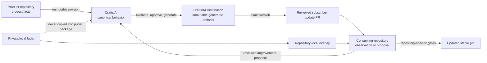

# Maintain shared Cratis AI behavior

This guide explains how Cratis maintainers improve shared AI behavior while
working in product, application, framework, documentation, or private
repositories.

The core rule is:

> Many repositories can discover an improvement, but `Cratis/AI` is the single
> canonical merge point and delivery is one-way through immutable releases.

Do not synchronize skill folders between repositories and do not copy changed
package bytes back into `Cratis/AI`.

> **Current availability:** the authoring, catalog, generation, evidence, and
> blocked release contracts exist, but no supported profile package is published
> yet. Keep current repository setups stable until an approved immutable release
> and reviewed update path exist.

## Understand the ownership boundaries

| Content | Authoritative owner | Examples |
| --- | --- | --- |
| Shared AI behavior | `Cratis/AI` | Skill workflow, trigger intent, reusable engineering rule, profile composition |
| Product fact | Owning product repository | Arc API, Chronicle behavior, Components usage, supported client version |
| Project context | Consuming repository | Product mix, build commands, local restrictions, endpoints without credential values |
| Private behavior | Consuming private repository | Unreleased architecture, incidents, infrastructure, customer or repository-specific workflow |
| Generated package bytes | `Cratis/AI.Distribution` | Host package, manifest, checksum, provenance, native projection |
| Promotion and subscriber updates | `Cratis/Workflows` | Canary, pin update, rollback, emergency disable, update pull request |

A skill can explain an authoritative product fact, but it cannot become a
competing authority for that fact. Update the owning product first and bind the
shared AI change to the product's immutable revision.

## Follow the complete flow



The reverse path carries a proposal and evidence, not synchronized files. The
forward path carries generated immutable artifacts, not source-repository
folders.

## Classify an improvement where you discover it

When an agent or maintainer notices that a skill, rule, or profile can improve,
classify it before changing shared content.

### General and public-safe behavior

Propose it to `Cratis/AI`.

Examples:

- a clearer projection-diagnostics workflow;
- a reusable C# or TypeScript convention;
- better trigger or near-miss behavior;
- a public-safe contributor review process;
- a reusable host projection.

### Product fact

Change the product repository first. Commit the API, documentation, specs, or
owner decision there, then cite the full immutable revision in the AI proposal.

Examples:

- a new Arc command behavior;
- a Chronicle contract change;
- a changed Components API;
- a supported client-version update.

### Private or repository-specific behavior

Keep it in the consuming repository's overlay.

Examples:

- private Studio implementation details;
- Stagehand infrastructure and recovery;
- customer or incident procedures;
- repository-specific release exceptions;
- internal endpoints or credential-acquisition procedures.

### Mixed behavior

Split it before proposing anything:

- reusable public-safe workflow → `Cratis/AI`;
- product fact → owning product repository;
- private names, environments, incidents, customers, and topology → local
  overlay.

## Handle an immediate local workaround

Do not edit installed or generated package bytes.

If work must continue before a shared fix is released:

1. Add the smallest repository-local rule or skill under the repository-owned
   overlay.
2. Mark it as a temporary local workaround and name the shared behavior it
   narrows or replaces.
3. Keep private facts local.
4. Record the intended removal with the improvement proposal or repository
   follow-up.
5. Remove the workaround after the repository adopts the fixed immutable
   profile version.

Avoid creating a second long-lived copy of the shared skill. Duplicate trigger
intents become ambiguous and drift independently.

## Propose the shared improvement

Use the
[Propose a shared Cratis AI improvement](../.github/ISSUE_TEMPLATE/shared-ai-improvement.yml)
issue form when the operation is authorized. Creating or updating an issue is a
separate repository effect; an agent should otherwise prepare the proposal for a
maintainer.

Include:

- the originating repository, when disclosure is allowed;
- the full immutable source revision;
- the affected products and profiles;
- whether the audience is public developers, engineering maintainers, or both
  through separate artifacts;
- the observed problem and desired behavior;
- authoritative product code, documentation, specs, tests, or owner decision;
- trigger, collision, compatibility, migration, and removal impact;
- private facts that were deliberately excluded.

Never attach credentials, private model transcripts, raw customer data, or
private implementation details to a public proposal.

## Implement the canonical change

After triage and ownership review:

1. Update the canonical source in `Cratis/AI`, not a generated adapter.
2. Keep one capability and one trigger intent per skill.
3. Distinguish framework contracts, Cratis conventions, and downstream product
   policy.
4. Bind product-sensitive claims to immutable product authority.
5. Add behavior, positive-trigger, negative-trigger, collision, security, and
   portability coverage appropriate to the risk.
6. Update affected component, profile, evidence, and host-projection contracts.
7. Regenerate deterministic catalogs and fixtures.
8. Run the complete repository gate.
9. Review the exact source revision and content digest.

Canonical public package skills live under `skills/`. Public-safe maintainer
skills live under `engineering/skills/`. Repository rules and their generated
host adapters follow the component catalog. Generated distribution trees are
never authoring inputs.

## Release and deliver the improvement

Once release prerequisites are satisfied:

1. Create one immutable release from the reviewed canonical tree.
2. Generate every profile/harness artifact from the same staged logical tree.
3. Publish generated bytes through the protected distribution path.
4. Have the subscriber controller open a normal pull request for each opted-in
   repository.
5. Change only exact subscription, package, lock, or host-settings pins.
6. Run that repository's own build, specification, security, documentation, and
   product canaries.
7. Merge only after review; never auto-merge profile updates.
8. Retain the previous exact pin for rollback.
9. Remove any temporary local workaround after adoption.

A consuming repository never publishes a shared Cratis AI package and never
pushes local generated adapters back upstream.

## Structure an internal repository

Use the narrowest public-safe engineering profile plus repository-owned context
and private overlays:

```text
AGENTS.md
.cratis/
├── PROJECT.md
└── ai.json
.agents/
└── skills/
    └── <repository-local-skill>/
        └── SKILL.md
.pi/
└── settings.json
```

- `.cratis/ai.json` selects exact profile versions and harnesses.
- `.cratis/PROJECT.md` records repository facts without credential values.
- `AGENTS.md` is the minimal bootstrap and always-on repository policy.
- `.agents/skills` contains local or private workflows.
- `.pi/settings.json` pins the matching exact Pi package.

Apply guidance in this order:

1. security, legal, and organization policy;
2. repository-local `AGENTS.md` and `.cratis/PROJECT.md`;
3. repository-local skills;
4. pinned shared product and engineering profiles;
5. general model knowledge.

A local rule may narrow shared behavior, but it must not weaken authorization,
security, or mandatory quality gates.

## Avoid old propagation patterns

Do not reintroduce:

- all-to-all folder propagation;
- automatic reverse synchronization;
- floating `latest` or branch-based subscriptions;
- direct edits to generated host folders;
- one confidential organization-wide AI package;
- consuming repositories as package publishers;
- automatic merging of subscriber updates;
- manual edits in `Cratis/AI.Distribution`.

Those patterns create competing authorities, unclear ownership, accidental
publication, and changes that cannot roll back predictably.

## Work during the current transition

Until supported profile packages and the subscriber controller are active:

- keep each repository's current stable setup;
- keep new private behavior in local overlays;
- send reusable proposals to `Cratis/AI`;
- update product facts in their owning repositories first;
- do not create another propagation mechanism;
- do not claim an unpublished profile is installable or supported;
- wait for an approved immutable release and reviewed update pull request before
  changing repository subscriptions.

See [Distribution and subscriptions](./ai-distribution-and-subscriptions.md) for
the release and subscription architecture, [maintainer adoption](./adopting-cratis-ai-for-maintainers.md)
for repository setup, and [private overlays](./private-repository-overlays.md)
for confidential and repository-specific behavior.
