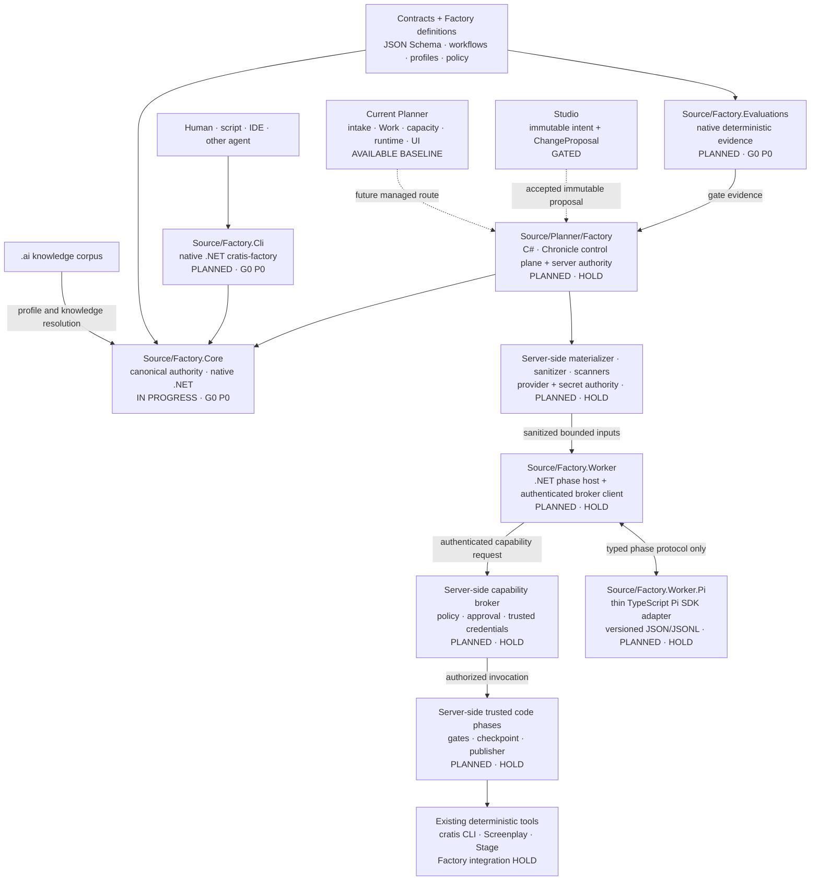

<!-- markdownlint-disable MD013 MD033 -->

# Cratis AI

**Cratis-native agent knowledge today. A governed software factory, built behind evidence gates.**

Cratis AI is the home of three connected products: shared knowledge for coding agents, the
deterministic specification of the Cratis Software Factory, and Planner—the existing managed
Claude application that will host the future Factory control plane.

[](#shared-cratis-agent-knowledge)
[](#deterministic-factory-foundation)
[](#current-cratis-planner)
[](#status-and-investment-gates)

[Choose your path](#choose-your-path) ·
[Understand the target architecture](#target-architecture) ·
[Read the architecture reference](Documentation/Factory/architecture.md) ·
[Follow program epic #59](https://github.com/Cratis/AI/issues/59)

> [!IMPORTANT]
> There is no supported public `cratis-factory` binary or managed Factory runtime yet. The current
> Python Stage 0 code is a temporary maintainer oracle—not an end-user prerequisite or the target
> architecture. [G0 P0 issue #67](https://github.com/Cratis/AI/issues/67) replaces it with native
> .NET, proves differential parity, and removes Python before G0 can pass or public support begins.

## Choose your path

| I want to… | Use today | Status |
| --- | --- | --- |
| Help an agent build idiomatic Cratis software | Explore the [shared `.ai` corpus](#shared-cratis-agent-knowledge) and its Copilot, Claude Code, and Codex adapters, or [install it as a plugin](#install-the-corpus-as-a-claude-code-plugin) | **Available** |
| Inspect a Cratis repository deterministically | Read the [Factory Stage 0 evidence](#deterministic-factory-foundation); maintainers can use the temporary reference oracle | **Public entrypoint HOLD on [#67](https://github.com/Cratis/AI/issues/67)** |
| Run current managed Claude work | Boot [Planner locally](#boot-the-current-planner-ui-safely) without credentials, then evaluate it only in a trusted environment | **Available local baseline; not Factory-secure** |

## The three pillars

### Shared Cratis agent knowledge

The canonical [`.ai/`](.ai/README.md) corpus teaches GitHub Copilot, Claude Code, and Codex how to
work with Chronicle, Arc, .NET/C#, React, Cratis Components, vertical slices, specifications, and
Cratis framework repositories. Rules state invariants, skills describe workflows, and agents
provide focused roles.

Everything is authored once under `.ai/` and surfaced through tool-specific adapters. Do not edit
generated or linked adapters directly. A consuming repository can add `.agents/PROJECT.md` for
project-local context; it is never propagated from this hub.

<details>
<summary><strong>Corpus layout, adapters, and validation</strong></summary>

```text
.ai/                  canonical source of truth
├── rules/            framework contracts and Cratis conventions
├── skills/           task workflows and verification checklists
├── agents/           specialist roles
├── prompts/          reusable entry points
├── hooks/            lifecycle guidance and validation
└── workflows/        shared automation definitions

.github/              GitHub Copilot adapters
.claude/              Claude Code adapters
.agents/ + AGENTS.md  Codex adapters
```

`.github/instructions` is currently a folder link to `.ai/rules`. That preserves one source of
truth, but the linked files do not have Copilot's `.instructions.md` suffix and are not all
auto-attached by glob. Claude Code and Codex consume their adapters, and Copilot can still access
the rules directly. Public marketplace packaging is planned, not released.

The corpus validator checks adapter integrity, rule and skill frontmatter, and a set of content
drift guards. Structural, adapter, and Codex failures are fatal; drift guards are warnings only. It
is wired as the `ai-corpus` gate in
[the quality-gate definitions](.ai/hooks/scripts/quality-gates.json) and as the `AI corpus` job in
[Factory Foundation CI](.github/workflows/factory-foundation.yml). Maintainers run it directly:

```shell
bash .ai/hooks/scripts/validate-ai-setup.sh
```

See [the corpus authority and adapter model](.ai/README.md) and
[the maintenance rules](.ai/rules/managing-ai-rules.md).

</details>

#### Install the corpus as a Claude Code plugin

A developer outside this repository can obtain the corpus without vendoring it. From inside
Claude Code:

```text
/plugin marketplace add Cratis/AI
/plugin install cratis@cratis
```

`marketplace add` resolves the GitHub repository directly. Distribution is git, so nothing has to
be accepted into a public registry for these two commands to work.

What loads is **45 skills and 18 slash commands**. What does not is the 35 rule files, the 12
agents, and every hook:

| Not carried | Why |
| --- | --- |
| `.ai/rules` — 35 files | Rules are not a plugin component type, so nothing loads them. The plugin teaches workflows; it does not carry the invariants those workflows assume. |
| `.ai/agents` — 12 files | The plugin loaders skip per-file symlinks, which is exactly what the agent adapters are. Shipping agents would require generated real files. |
| `.ai/hooks` | Deliberately excluded. Seven of the eight gates in [the quality-gate definitions](.ai/hooks/scripts/quality-gates.json) key on `Planner.slnx` and `Source/Planner/package.json`, so in any other repository their `requires` go unsatisfied and the `Stop` gate degrades to a no-op. [The hooks reference](.ai/hooks/README.md) documents wiring them by hand. |

Slash commands keep the source filename: `/cratis:add-concept.prompt`, not `/cratis:add-concept`.
The `.prompt.md` suffix is what Copilot's prompt discovery keys on and what the corpus validator
requires, so it is not currently removable.

**For the whole corpus — rules, agents, and hooks — clone this repository or add it as a
submodule**, and let each tool resolve its own adapters. Pi needs nothing extra either way: it
reads the root `AGENTS.md` and `.agents/skills` natively.

### Deterministic Factory foundation

The repository contains strict contracts, capability and profile definitions, a deterministic
workflow compiler, explainable ecosystem resolution, immutable-revision preflight, and an
evaluation catalog. The current executable Stage 0 implementation demonstrates those semantics
without model calls, provider credentials, repository writes, or runtime operations.

It currently provides:

- Versioned JSON Schemas and canonical content hashes.
- Explainable Arc, Chronicle, React, Components, and Chronicle-client discovery.
- Deny-by-default policy and deterministic workflow compilation.
- A reviewed 40-case catalog with **10 currently executable cases**. Passing 10/10 is full
  executable-subset coverage—not full catalog, product, or release coverage.
- Integrity-only v2 artifact and provenance contracts. They are not trusted runtime authority,
  storage receipts, sanitization attestations, or permission to dispatch.

**Stage 0 is the current implementation foundation. G0 is a separate investment gate and has not
passed.** Native parity, the historical benchmark, usability evidence, and other G0 requirements
remain open.

The supported target is a native, self-contained .NET experience:

```text
cratis-factory inspect
cratis-factory preflight
cratis-factory validate
cratis-factory evaluate
```

These are **target commands, not an available public CLI today**. The tooling boundary is exact:

- End users receive a signed, self-contained artifact and need no language runtime or development
  toolchain—specifically no .NET SDK, Python, Node, Pi, provider login, GitHub CLI, or existing
  `cratis` CLI for deterministic Factory operations.
- Contributors to `Factory.Core`, `Factory.Evaluations`, and `Factory.Cli` use the
  repository-pinned .NET SDK. The .NET worker host and Planner backend use that toolchain too.
- Only contributors changing the TypeScript Pi adapter or the React/TypeScript Planner UI need
  supported Node.js 20+, Corepack, and the repository-pinned Yarn 4 version. Node and Pi are never
  loaded by deterministic Core, CLI, or evaluation operations.

Signed self-contained releases are governed by
[distribution issue #62](https://github.com/Cratis/AI/issues/62).

<details>
<summary><strong>Why the current Stage 0 implementation is not the product</strong></summary>

The temporary Python implementation under `Factory/scripts/` is an executable specification and
differential-parity oracle for maintainers. Its commands and setup remain documented in
[the foundation reference](Factory/README.md), but they are deliberately not the public quickstart.

[G0 P0 #67](https://github.com/Cratis/AI/issues/67) ports canonical JSON, resolution, compilation,
policy, preflight, diagnostics, projections, evaluation, and adversarial invariants to .NET. Python
and .NET must produce contractually identical material results against the same fixtures and
vectors. After independent acceptance, .NET becomes authoritative and the Python requirements,
implementation, and duplicate tests are deleted rather than maintained as a second engine.

Read the [contracts and interfaces](Documentation/Factory/contracts-and-interfaces.md),
[evaluation semantics](Documentation/Factory/evaluations.md), and
[current enforcement matrix](Documentation/Factory/enforcement-matrix.md).

</details>

### Current Cratis Planner

[Planner](Documentation/Planner/index.md) is a runnable event-sourced Cratis application. It mirrors
GitHub issues and pull requests, groups and schedules work, manages Claude account capacity,
selects Docker or Kubernetes worker runtimes, streams a live console, supports steering and stop,
tracks usage, and handles operational alerts. Its UI is and remains React/TypeScript with Arc and
Cratis Components.

Planner is valuable infrastructure and the comparison baseline. It is not the managed Factory:

| Current `Planner.Work` | Future `Source/Planner/Factory` |
| --- | --- |
| GitHub and alert intake | Normalized Factory objectives and immutable plans |
| One work item → one Claude session | Durable workflow graph, phases, attempts, and leases |
| Claude account capacity | Server-authoritative provider and model decisions |
| Docker/Kubernetes runtime selection | Authenticated phase dispatch and reconciliation |
| Free-form callback and result text | Ordered, idempotent, typed Factory events and evidence |
| Current Work/console/steering UI | Run, gate, approval, evidence, correction, and recovery views |
| Agent may receive GitHub publishing credentials | Planner-owned idempotent trusted publisher |

The new bounded context will live beside the legacy path. One atomic route must select legacy Work
or Factory for each intake item so two orchestration loops can never claim the same issue.

#### Boot the current Planner UI safely

Prerequisites: .NET 10 SDK, Node.js 20+, Corepack/Yarn 4, and Docker.

```shell
corepack enable
yarn install
dotnet run --project Source/Composition
```

This boots the Aspire development composition and UI; it does **not** configure real work.

> [!CAUTION]
> Current Planner has no in-app authentication. Its Aspire dashboard is unsecured in local
> development, and its Vite server is configured with host exposure. Use localhost plus host
> firewall isolation, or place every surface behind a correctly configured authentication proxy.
> Do not expose it to an untrusted network, create a tunnel to it, or enter real Claude/GitHub
> credentials into an instance reachable by other users. The README intentionally stops at a
> credential-free UI boot; the [local operations guide](Documentation/Planner/running-locally.md)
> is for trusted development environments.

## Status and investment gates

| Status | Capability | Honest meaning |
| --- | --- | --- |
| **Available** | Shared `.ai` corpus | Canonical knowledge and adapters exist; the `ai-corpus` validator passes locally and in CI. |
| **Reference oracle** | Factory Stage 0 | Deterministic semantics execute in temporary Python maintainer tooling; this is not the supported user runtime. |
| **In progress — G0 P0** | Native `Factory.Core` | Source and specs exist and build, but the project has not reached differential parity with the Python oracle. Nothing consumes it yet. |
| **Planned — G0 P0** | Native `Factory.Evaluations` and `Factory.Cli` | Not started; no `Source/Factory.Evaluations` or `Source/Factory.Cli` exists. [#67](https://github.com/Cratis/AI/issues/67) must reach differential parity and retire Python before G0 can pass or any public Factory release begins. |
| **Available local baseline** | Current Planner + Claude worker | Existing managed workflow for comparison; lacks the Factory authority, protocol, isolation, and publishing boundary. |
| **Planned — implementation HOLD** | `Planner.Factory` plus server materializer, sanitizer, scanners, broker, and trusted code phases | No managed orchestration or server-side authority execution until the native core and authority work in [#52](https://github.com/Cratis/AI/issues/52), [#64](https://github.com/Cratis/AI/issues/64), [#65](https://github.com/Cratis/AI/issues/65), and [#66](https://github.com/Cratis/AI/issues/66) is accepted. |
| **Planned — implementation HOLD** | .NET `Factory.Worker` and TypeScript `Factory.Worker.Pi` | The phase host, authenticated broker client, and Pi adapter are planned; no worker or adapter dispatch is authorized. |
| **Existing tools — Factory integration HOLD** | `cratis` CLI, Screenplay, Stage, build, test, browser, and git capabilities | Underlying tools exist independently; no Factory path may invoke them until the server broker and trusted code-phase boundary is accepted. |
| **Gated future** | Read-only investigation, golden stack, dual harness, Studio | Each stage begins only after its preceding evidence gate is accepted. |

## Target architecture

Language-neutral contracts and definitions remain the public semantic boundary. Native .NET code
becomes the sole authority for deterministic operations and managed orchestration. TypeScript is
used only where the Pi SDK requires it and for the existing React UI.



If Mermaid is unavailable, read the flow as:

1. The knowledge corpus and versioned Factory definitions feed `Factory.Core` resolution.
2. `Factory.Cli` and `Planner.Factory` call the same in-process .NET deterministic authority.
3. Planner-side trusted server authority owns scanners, provider and secret decisions, the
   capability broker, and materialization and sanitization of exact bounded phase inputs.
4. The .NET worker host validates the phase protocol, enforces budgets and cancellation, emits
   ordered events, and uses only an authenticated client to request brokered capabilities.
5. The TypeScript Pi adapter exchanges versioned JSON/JSONL with the host. It cannot call the
   capability plane, obtain secrets, publish, or advance the workflow directly.
6. Only server-side trusted code phases may reach deterministic capabilities and produce gate,
   checkpoint, or publication evidence. Those tools exist independently, but their Factory
   integration remains on HOLD. The worker never publishes.

### Target project ownership

| Target | Responsibility |
| --- | --- |
| `Contracts/` + `Factory/` | Language-neutral schemas, workflows, profiles, policies, capabilities, fixtures, and canonical vectors |
| `Source/Factory.Core` | Native .NET canonical JSON, validation, resolution, workflow compilation, policy, preflight, and operation semantics |
| `Source/Factory.Evaluations` | Native .NET fixture execution, coverage accounting, and authoritative result verification |
| `Source/Factory.Cli` | Native .NET `cratis-factory` human and machine command surface |
| `Source/Factory.Worker` | .NET phase host for protocol validation, budgets, cancellation, ordered events, and an authenticated capability-broker client |
| `Source/Factory.Worker.Pi` | Thin, exact-pinned TypeScript Pi SDK adapter speaking only versioned JSON/JSONL to the host |
| `Source/Planner/Factory` | C#/Chronicle graph, leases, approvals, evidence, recovery, and server-side authority for provider/secret decisions, artifact scanners, materialization, sanitization, capability brokering, trusted code phases, and publishing |
| `Source/Planner` frontend | Existing React/TypeScript managed experience, extended with Factory projections |

The existing `cratis` CLI remains a separate deterministic capability provider. It is not a
prerequisite for `inspect`, `preflight`, `validate`, or `evaluate`, and it gains no Factory, Pi,
provider, session, or run-state dependencies.

## Security and evidence ethos

The following are **target Factory invariants**, not claims about the legacy Planner worker:

- Humans own intent and acceptance.
- Deterministic code owns workflow state, permissions, retries, gates, commits, publishing, and
  operations.
- Agents reason inside one bounded phase; skills never grant authority.
- Workers are disposable, non-root, scope-limited, time-limited, and credential-minimized.
- Workers receive no secret-store access, direct content-addressed-store access, ambient repository
  access, provider-secret resolution authority, authoritative broker, or publishing capability.
- Planner-side trusted server code owns provider and secret authority, scanners, bounded input
  materialization and sanitization, the capability broker, and consequential code phases.
- Required unavailable evidence is `blocked`, never represented as passing.
- PII classification follows inputs, artifacts, provider routing, telemetry, and retention.
- Machines consume versioned structured facts; humans see explanations over those same facts.
- Pi is replaceable, cannot call capabilities directly, and never owns the cross-phase graph.

Read the [security and privacy model](Documentation/Factory/security-and-privacy.md),
[enforcement matrix](Documentation/Factory/enforcement-matrix.md), and
[CLI non-interference contract](Documentation/Factory/cli-boundary.md).

<details>
<summary><strong>Repository map: current and planned</strong></summary>

```text
Cratis/AI
├── .ai/                         current canonical shared knowledge
├── Contracts/                   current language-neutral Factory protocols
├── Factory/                     current definitions, fixtures, and temporary oracle
├── Workflows/                   current immutable workflow definitions
├── Evaluations/Factory/         current catalog
├── Source/
│   ├── Planner/                 current Planner app and legacy Work path
│   │   └── Factory/             PLANNED managed C#/Chronicle context
│   ├── Claude/                  current legacy Planner worker
│   ├── Composition/             current local Aspire composition
│   ├── Factory.Core/            IN PROGRESS native .NET authority (G0 P0)
│   ├── Factory.Core.Specs/      IN PROGRESS specs for the native authority
│   ├── Factory.Evaluations/     PLANNED native .NET evaluation engine (G0 P0)
│   ├── Factory.Cli/             PLANNED native .NET cratis-factory (G0 P0)
│   ├── Factory.Worker/          PLANNED .NET phase host and broker client
│   └── Factory.Worker.Pi/       PLANNED thin TypeScript Pi adapter
└── Documentation/
    ├── Planner/                 current Planner operation and deployment
    └── Factory/                 product, architecture, security, UX, and roadmap
```

Application repositories receive a small project manifest and local knowledge—not a copied
Factory runtime. The target is that Planner consumes `Factory.Core` in process and never shells
out to Python. Today no such reference exists: `Source/Planner/Planner.csproj` declares no
`ProjectReference`, and `Factory.Core` is only a sibling project in `Planner.slnx`.

</details>

## Roadmap and governance

The program advances through evidence gates, not feature-count momentum:

1. **Stage 0 foundation—current:** contracts, definitions, a temporary executable oracle, and the
   initial immutable evaluation subset.
2. **G0 constitution/baseline—not yet passed:** [G0 P0 #67](https://github.com/Cratis/AI/issues/67)
   requires native parity and Python retirement; G0 also requires historical baselines, usability,
   security, and contract acceptance.
3. **G1 read-only investigation:** safe shadow comparison with typed evidence and zero agent source
   or GitHub writes.
4. **G2 golden stack:** one excellent `.NET + Arc + Chronicle + React + Components` workflow.
5. **G3 managed dual harness:** Pi and Claude behind one protocol on controlled real work.
6. **G4 Studio proposal loop:** immutable model revisions and conflict-aware proposals.

Start with [program epic #59](https://github.com/Cratis/AI/issues/59) and native-runtime
[G0 P0 #67](https://github.com/Cratis/AI/issues/67). The core workstreams cover
[contracts/evaluations #49](https://github.com/Cratis/AI/issues/49),
[ecosystem intelligence #50](https://github.com/Cratis/AI/issues/50),
[worker and Pi adapter #51](https://github.com/Cratis/AI/issues/51),
[security/evidence #52](https://github.com/Cratis/AI/issues/52),
[Planner control plane #53](https://github.com/Cratis/AI/issues/53),
[read-only pilot #54](https://github.com/Cratis/AI/issues/54),
[golden stack #55](https://github.com/Cratis/AI/issues/55), and
[human/machine experience #60](https://github.com/Cratis/AI/issues/60).

See the [staged roadmap](Documentation/Factory/roadmap.md). A gate may result in “stop” or “improve
the corpus”; more choreography is not automatically progress.

## Documentation

| Start here | What it covers |
| --- | --- |
| [Shared knowledge](.ai/README.md) | Authority, profiles, adapters, and maintenance |
| [Factory foundation reference](Factory/README.md) | Current maintainer oracle and precise limitations |
| [Factory product decision](Documentation/Factory/index.md) | Product surfaces and ownership |
| [Factory architecture](Documentation/Factory/architecture.md) | Control plane, workers, policy, and evidence |
| [Experience principles](Documentation/Factory/experience-principles.md) | Equal human/machine interfaces and usability gates |
| [Planner overview](Documentation/Planner/index.md) | Current capabilities and repository layout |
| [How Planner works](Documentation/Planner/how-it-works.md) | Current GitHub issue-to-Claude flow |
| [Planner local operations](Documentation/Planner/running-locally.md) | Trusted-environment setup and quality gates |

## Contributing

Keep the authority planes separate: edit shared knowledge in `.ai/`, language-neutral definitions
in `Contracts/`, `Workflows/`, and `Factory/`, native deterministic authority in the planned .NET
projects, and managed behavior in `Source/Planner/Factory`. Preserve the existing `cratis` CLI
boundary.

Every executable Factory slice requires architecture, security/privacy, engineering, and developer
experience review. Claims of completion require fresh, inspectable evidence.
